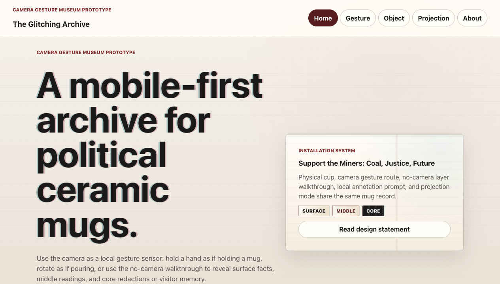
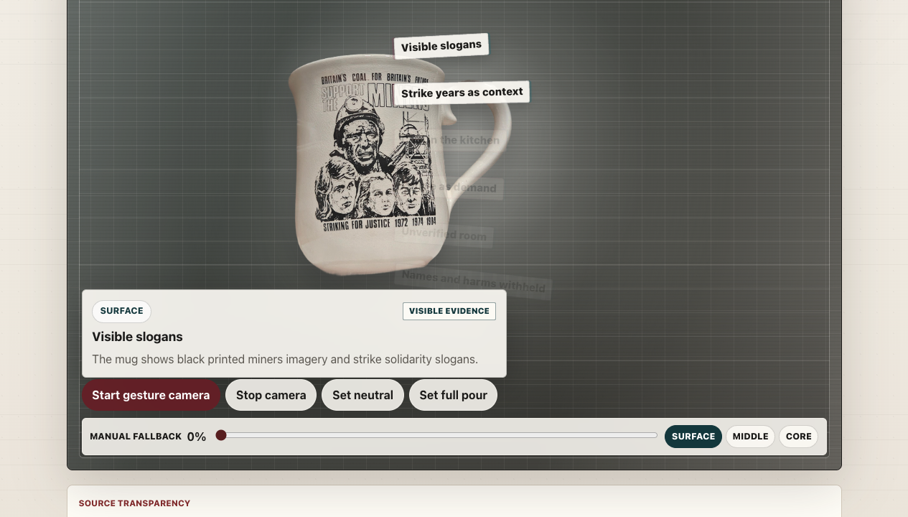
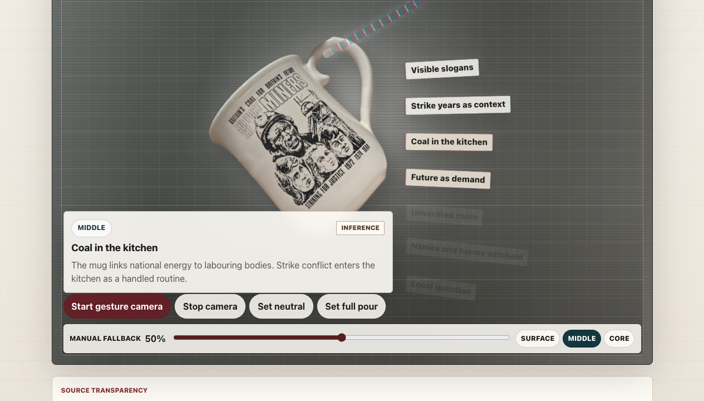
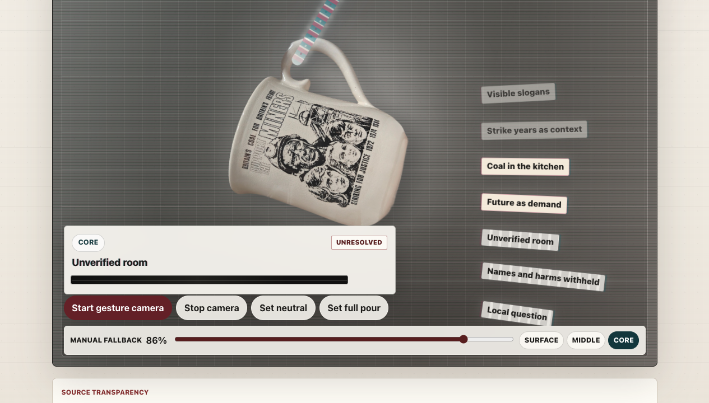
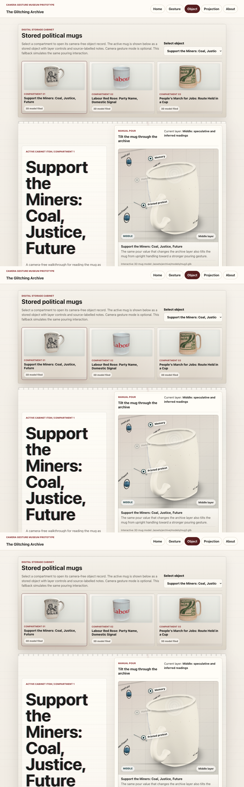
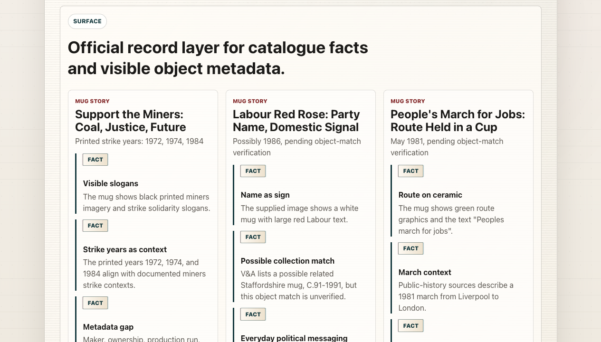
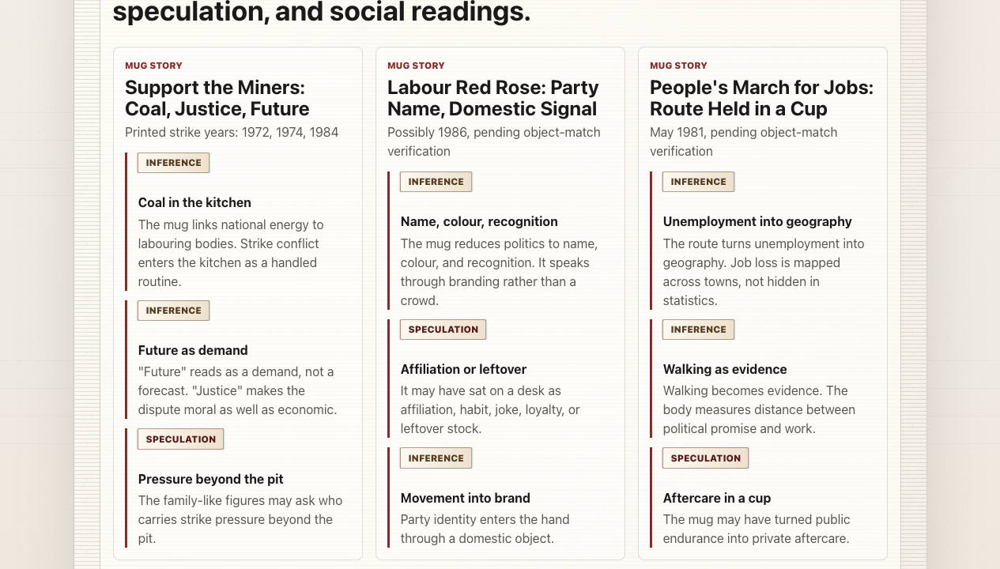
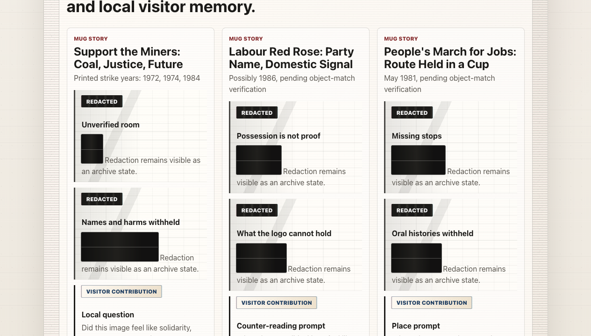
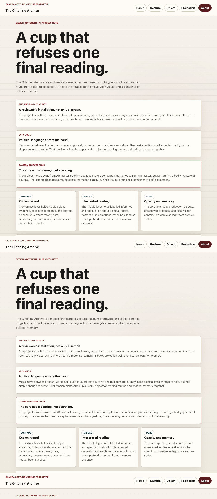

# The Glitching Archive — Current Web Experience for PPT Update

## 1. Current Experience Summary

The current website presents The Glitching Archive as a camera gesture museum prototype for political ceramic mugs. The visitor is no longer asked to scan an AR marker. Instead, the key interaction is a hand-pouring gesture: the camera is used locally as a gesture sensor, and the visitor rotates their hand as if pouring from a mug. That pour value tilts the mug image and controls the flow of archive information through three labelled layers: Surface, Middle, and Core.

Surface carries visible object evidence, catalogue context, and metadata gaps. Middle carries labelled inference and speculation about political, social, domestic, and emotional readings. Core carries unresolved questions, redaction, right to opacity, and local visitor contribution. Each fragment keeps a visible source label, so the interface does not present speculation or visitor memory as confirmed fact.

The prototype also remains usable without camera access. The no-camera object walkthrough uses the same mug records, layer logic, and pour slider. The projection wall gathers the same layered archive material into a room-scale display, with optional sound-wall controls and visible visitor-memory states. The About page explains the move from scanning to pouring, the privacy model, right to opacity, and Codex/AI as implementation support rather than historical proof.

## 2. Key User Flow

1. Visitor enters homepage.
2. Visitor chooses gesture pour or no-camera walkthrough.
3. Visitor selects a mug.
4. Visitor performs a hand-pouring gesture, or uses slider fallback.
5. The mug tilts and information flows through Surface / Middle / Core.
6. Visitor can read source labels and unresolved/redacted content.
7. Projection wall gathers the archive layers and visitor memory.
8. About page explains ethics and process.

## 3. Function Map

| Function | Route | PPT Use |
| --- | --- | --- |
| Home / concept entry | `/` | Introduce current prototype language |
| Camera gesture pour | `/gesture/:id` | Show main interaction replacing AR scan |
| Mug switching | `/gesture/:id`, `/object/:id` | Show multi-object archive system |
| No-camera walkthrough | `/object/:id` | Show accessibility and fallback path |
| Source labels | `/gesture/:id`, `/object/:id`, `/projection` | Show ethical claim status |
| Surface / Middle / Core layers | `/gesture/:id`, `/object/:id`, `/projection` | Explain narrative structure |
| Redaction / right to opacity | `/projection`, `/about` | Show uncertainty as content |
| Visitor contribution | `/object/:id`, `/projection` | Show local co-curation loop |
| Projection wall | `/projection` | Show installation-scale mode |
| About / ethics / AI note | `/about` | Support process and ethics slide |

## 4. Screenshot-Based Page Notes

### 01 - Home Page

What it shows:
- Camera gesture museum prototype framing.
- Main entry buttons for gesture pour, no-camera walkthrough, and projection wall.
- Installation system card linking physical cup, camera gesture, fallback, annotation prompt, and projection mode.

PPT update note:
Replace old AR-marker entry language with camera gesture and pour interaction language.

### 02 - Gesture Surface State

What it shows:
- Gesture pour stage using the miners mug.
- Camera permission state remains readable without granting camera access.
- Manual fallback slider at 0% pour.
- Surface layer card with visible-evidence label.

PPT update note:
Use this to explain camera-as-input plus fallback, not object recognition or marker scanning.

### 03 - Gesture Middle State

What it shows:
- Mug image tilts as pour value increases.
- Information fragments flow across the stage.
- Middle layer displays an inference label.
- Slider fallback demonstrates the same state without camera permission.

PPT update note:
Use this for the core interaction slide: hand movement controls pour value, and pour value reveals interpretation.

### 04 - Gesture Core State

What it shows:
- Full-pour state moves the interface into Core.
- Redacted/unresolved content is foregrounded.
- Core layer uses unresolved/redacted status rather than invented certainty.
- Slider fallback remains visible and usable.

PPT update note:
Use this for the right-to-opacity slide and to show that redaction is an archive state, not a missing screen.

### 05 - No-Camera Object Walkthrough

What it shows:
- Digital storage cabinet with three mug records.
- Object selector and selected mug metadata.
- Manual pour controls for Surface / Middle / Core.
- Source-labelled object fragments and local co-curation form further down the page.

PPT update note:
Use this to show that the project is accessible when visitors cannot or do not grant camera access.

### 06 - Projection Surface State

What it shows:
- Projection wall content in Surface mode.
- Three mug stories arranged as wall-scale archive cards.
- Fact labels attached to visible evidence and catalogue context.

PPT update note:
Replace generic projection mockups with this evidence-wall view.

### 07 - Projection Middle State

What it shows:
- Projection wall in Middle mode.
- Inference and speculation labels remain visible.
- Social and emotional readings are grouped by mug.

PPT update note:
Use this to clarify that speculative readings are authored and labelled, not automatically verified history.

### 08 - Projection Core State

What it shows:
- Projection wall in Core mode.
- Redacted fragments and visitor-contribution prompts appear together.
- The interface keeps withheld material visible as an ethical stance.

PPT update note:
Use this for projection/co-curation and right-to-opacity slides.

### 09 - About / Design Statement

What it shows:
- Design statement and current prototype framing.
- Explicit explanation that the core act is pouring, not scanning.
- Surface / Middle / Core ethics cards.
- Privacy, local contribution, right-to-opacity, source transparency, and Codex process notes.

PPT update note:
Use this as the source for final ethics, access, and AI process wording.

## 5. What Changed From the Original PPT

- From AR marker scanning to camera gesture pouring.
- From "scan the marker" to "perform the pour".
- From AI-generated speculative archive to pre-authored, source-labelled layers, with any local generator output labelled as editable prototype material.
- From AR overlay to gesture-controlled web stage.
- From fully immersive sound promise to prototype-level visual interaction with optional layer-reactive audio captions and generated fallback.
- From generic co-curation loop to local visitor contribution stored in the browser and surfaced on the projection wall.
- From object recognition to camera-as-input for hand gesture sensing.

## 6. Suggested PPT Rewrite Language

### A. New Concept Sentence
The Glitching Archive is a camera gesture museum prototype where political ceramic mugs are read as containers of daily routine and political memory.

### B. New Interaction Sentence
Instead of scanning a marker, the visitor performs a pouring gesture; the pour value tilts the mug and reveals Surface, Middle, and Core archive layers.

### C. New Installation Sentence
The installation joins a physical cup, camera gesture route, no-camera object walkthrough, local co-curation prompt, and projection wall using the same mug records.

### D. New Ethics Sentence
Every fragment is labelled as fact, inference, speculation, visitor contribution, or redaction, so uncertainty and right to opacity remain visible.

### E. New Final Takeaway
The prototype demonstrates a reviewable interaction system, not a finished museum database: it makes archive limits readable while inviting careful participation.

## 7. Missing or Partial Features

- Camera permission cannot be demonstrated in static screenshots; gesture mode needs a real browser/device with camera access.
- Hand tracking accuracy depends on lighting, camera quality, hand visibility, and device performance.
- Visitor memory is LocalStorage-only and stays in the current browser.
- External sound files are not fully supplied; the site presents captions and can use generated Web Audio fallback after user interaction.
- AI generation is not historical proof. Local generated/speculative text is presented as editable prototype material, not verified archive data.
- The current core interaction is not AR marker scanning; legacy marker paths may exist but are not the current experience.

## 8. Recommended PPT Slide Updates

| Slide Type | Current Mismatch | Suggested Update | Screenshot |
| --- | --- | --- | --- |
| Title slide | May still imply AR marker museum | Rename as camera gesture museum prototype | `01-home.png` |
| Interaction flow slide | Scan marker -> AR reveal | Visitor performs pour -> layers reveal | `03-gesture-middle.png` |
| Technical system slide | AR marker/image tracking | Camera gesture input + slider fallback + LocalStorage | `02-gesture-surface.png` |
| User journey slide | Phone scans object marker | Choose mug, pour, read labels, contribute locally | `05-object-walkthrough.png` |
| Projection / co-curation slide | Generic sound wall promise | Projection wall shows labelled fragments and visitor memory | `08-projection-core.png` |
| Ethics / access slide | Speculation may look like fact | Show labels, redaction, right to opacity, no-camera route | `09-about.png` |
| Final prototype showcase slide | Concept render only | Use current website captures as proof of implementation | `01-home.png`, `03-gesture-middle.png`, `08-projection-core.png` |
